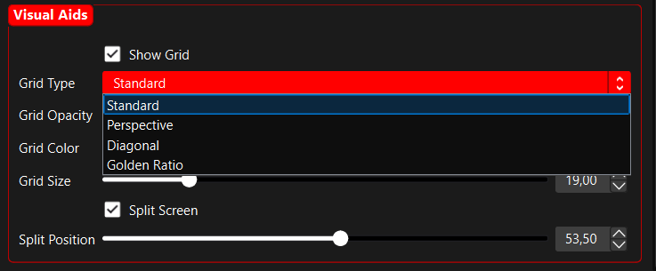

  <h1>🎥 Lenscorrector Professional</h1>
  
A powerful OBS Studio filter for advanced lens correction and camera profile management.

  
Perfect for streamers, content creators, and professional broadcasters using wide-angle lenses.

  
  
  
  
  
  

  <h3>Filter Interface</h3>
  
  
<i>The main filter interface with all correction options</i>

  <h3>Before / After Comparison</h3>
  
  
<i>Example of lens correction with a wide-angle camera</i>

  <h3>Grid Overlay System</h3>
  
  
<i>Different grid types for composition and correction</i>

## 📑 Table of Contents
- [✨ Key Features](#-key-features)
- [🚀 What's New in v1.1.0](#-whats-new-in-v110)
- [🎯 Use Cases](#-use-cases)
- [💻 Installation](#-installation)
- [🛠️ Configuration](#️-configuration)
- [🔧 Troubleshooting](#-troubleshooting)
- [📄 License](#-license)

## ✨ Key Features

### 📸 Advanced Lens Correction
- **Focal Length Presets**: 
  - Built-in presets from 8mm to 100mm
  - Custom correction values
  - Fine-tuning capabilities
  - Automatic correction based on lens type
- **Quality Settings**:
  - Multiple quality levels (Low/Medium/High)
  - Performance mode for resource optimization
  - Real-time preview
  - Adjustable render settings

### 🎯 Professional Grid System
- **Multiple Grid Types**:
  - Standard grid
  - Perspective grid
  - Diagonal lines
  - Golden ratio overlay
- **Grid Customization**:
  - Adjustable opacity
  - Color selection
  - Size control
  - Split-screen preview

### 💾 Profile Management
- **Camera Profiles**:
  - Save and load custom profiles
  - Profile organization
  - Quick switching between setups
  - Automatic profile loading
- **Settings Management**:
  - Export/Import capabilities
  - Backup functionality
  - Profile sharing
  - Version control

## 🚀 What's New in v1.1.0

### ⚡ Performance Optimizations
- **Enhanced Rendering Engine**: Significantly improved performance with optimized buffer management
- **Intelligent Parameter Updates**: Parameters update only when values change, reducing GPU load
- **Advanced Performance Mode**: Uses a streamlined algorithm instead of frame-skipping for smoother rendering
- **Resource Management**: Better GPU resource handling and memory cleanup

### 🛡️ Improved Stability
- **Robust Error Handling**: Comprehensive error protection for critical operations
- **Enhanced Initialization**: Default values ensure stability even with missing settings
- **Detailed Diagnostics**: Expanded debugging capabilities for easier troubleshooting

### 📊 Visual Improvements
- **Adaptive Grid System**: Grid lines automatically adjust thickness based on resolution
- **Accurate Color Representation**: Fixed color handling for grid lines in all modes
- **Edge Artifact Prevention**: Eliminated flickering at image edges with strong corrections
- **Enhanced Split-Screen**: More reliable side-by-side comparison

## 🎯 Use Cases

### Content Creation
- Fix wide-angle distortion in vlogs
- Correct GoPro footage
- Maintain straight lines in architectural shots
- Professional-looking real estate videos

### Streaming Setup
- Live lens correction for webcams
- Multi-camera setup management
- Different profiles for different scenes
- Professional stream quality

### Professional Broadcasting
- Studio camera correction
- Live event coverage
- Sports broadcasting
- News production

## 💻 Installation

1. Download the latest release from the releases page
2. Place the script in your OBS scripts folder:
   - Windows: `%APPDATA%\obs-studio\scripts`
3. In OBS Studio:
   - Go to Tools → Scripts
   - Click the + button
   - Select `lenscorrector.lua`
   - Add the filter to your video source

### Requirements
- OBS Studio 30.0 or newer
- Windows 10/11
- DirectX 11 compatible graphics card

## 🛠️ Configuration

### Basic Setup
1. Add the "Lenscorrector Professional" filter to your video source
2. Select your lens focal length from the presets
3. Adjust the correction strength if needed
4. Save your settings as a profile

### Advanced Settings
- **Fine-Tuning**: Use the slider for precise corrections
- **Grid System**: Choose and customize your preferred grid type
- **Quality**: Select the appropriate quality level for your setup
- **Performance Mode**: Enable for resource-constrained systems
- **Profiles**: Create profiles for different cameras or setups

## 🔧 Troubleshooting

### Common Issues
1. **Performance**:
   - Enable performance mode for resource-constrained systems
   - Check GPU compatibility
   - Monitor system resources
   - Consider lowering other OBS video settings

2. **Visual Issues**:
   - Verify focal length selection
   - Check correction strength
   - Ensure proper source resolution
   - Try different grid settings

3. **Profile Management**:
   - Check write permissions
   - Verify profile directory
   - Clear cache if needed
   - Reload OBS if necessary

## 📄 License

This project is licensed under the GPLv3 License - see the LICENSE file for details.

---

  
Created by TheGeekFreaks

  
Copyright 2025 All rights reserved.

